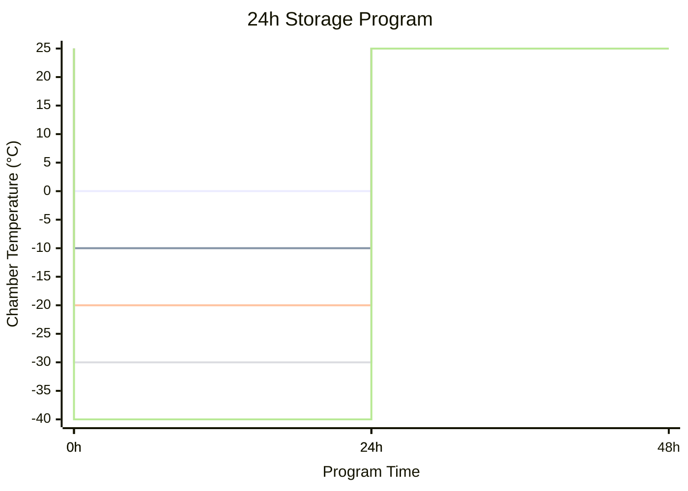
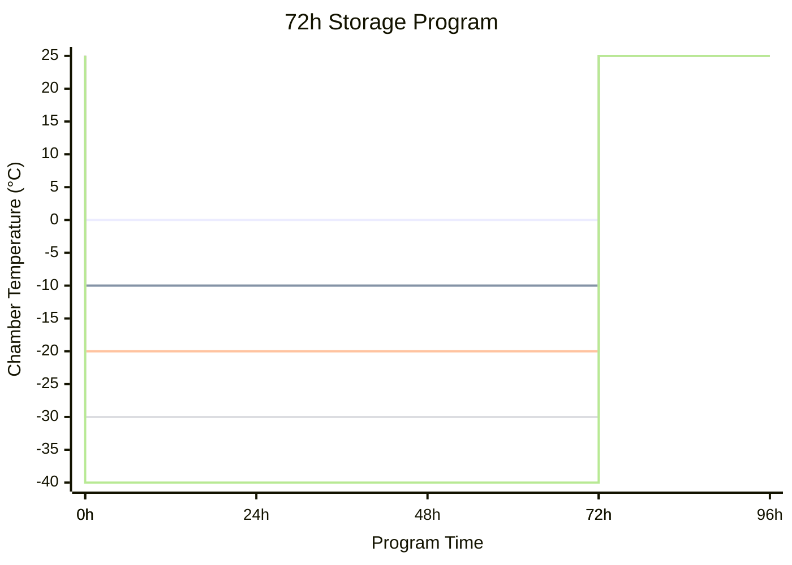

# UCT003 Operating Instructions

## Low Temperature Storage

### 24h Period

#### Start-up (24h)

Select appropriate program for the current thermal stage:

- `UCT003_-00C_24Hx1`: 0 °C
- `UCT003_-10C_24Hx1`: -10 °C
- `UCT003_-20C_24Hx1`: -20 °C
- `UCT003_-30C_24Hx1`: -30 °C
- `UCT003_-40C_24Hx1`: -40 °C

3 total storage repetitions are necessary. Loop the program for:

- 1 program cycle if present at work tomorrow.
- 2 program cycles if today is 2 subsequent days off work (Fridays, public holidays).
- 3 program cycles remaining (maximum) for long weekends.
- **Reduce the above for any cycles already done.**

### 72h Period

#### Start-up (72h)

- Select appropriate program for the current thermal stage:
  - `UCT003_-00C_72H`: 0 °C
  - `UCT003_-10C_72H`: -10 °C
  - `UCT003_-20C_72H`: -20 °C
  - `UCT003_-30C_72H`: -30 °C
  - `UCT003_-40C_72H`: -40 °C
- Only ever run for 1 program cycle.

### Early End

End chamber program whenever possible during the +25 °C end period to reduce chamber operating time. Resume any remaining 24h low temperature storage periods the next day, ±2h tolerance, as new programs.

## Low Temperature EMF Measurement

Perform a low temperature EMF measurement at any point of a low temperature storage period once for each set point temperature (00, -10, -20, -30, -40 °C). Interrupting a 24h period is preferable.

1. Allow for at least 12h at low temperature for thermal saturation.
1. Record the chamber program time.
1. End the running Chamber Program.
1. Perform EMF Measurement:
   1. Set the Agilent 34450A 5.5 Digit Multimeter to `DCV` (DC Voltage).  
       The instrument will automatically range.
   2. Remove the battery and quickly probe the terminals.  
       The styrofoam insulation is not necessary.
   3. Record the voltage.
   4. Replace the battery repeat for the next.  
    Always work from `C01` to `C14` in order.
1. Start the same chamber program again, setting `Advance Time` to the program time recorded earlier.

## Discharge Tests & Varied Discharge

1. Always Begin `C08` to `C14` first following a low temperature storage period.
1. Follow with `C01` to `C07` discharge tests.
1. Vary the discharge of `C01` to `C07`. Then replace `C08` to `C14` on the bench for varied discharge.
1. Begin the next low temperature storage period immediately following varied discharge of `C08` to `C14`.  
  Delay start of varied discharge tests if necessary to prevent idle standing at deep discharge.
