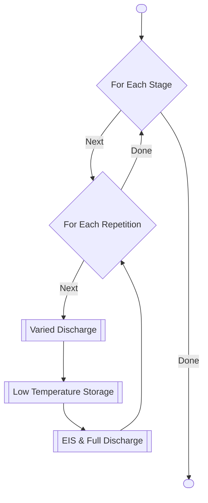
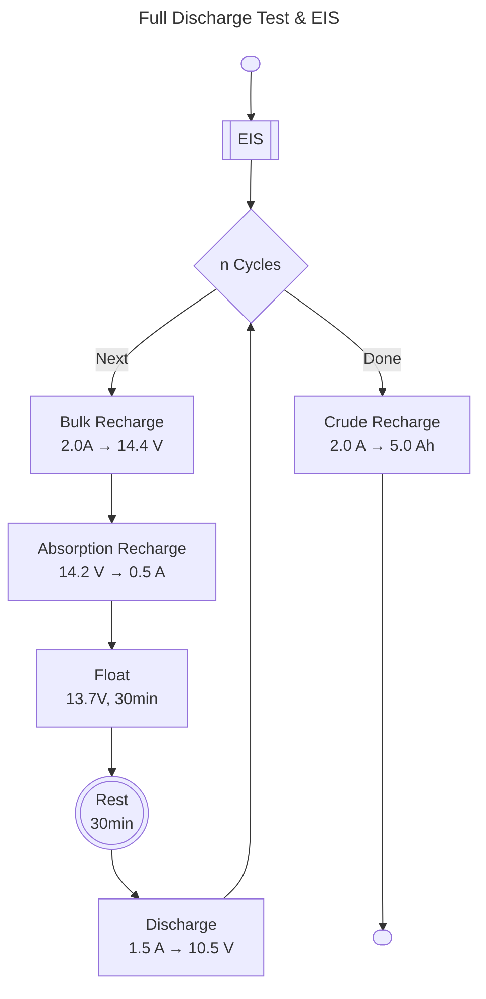
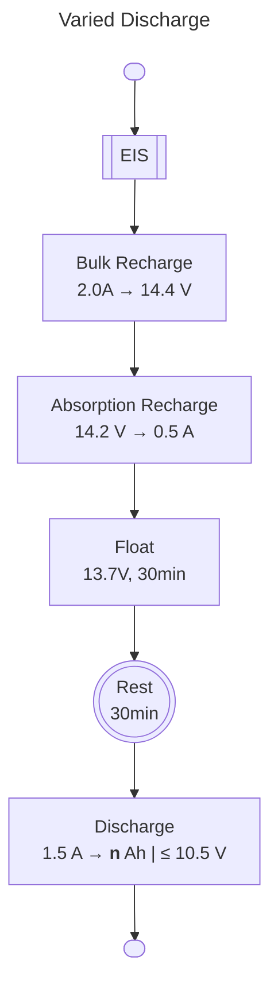

# UCT003 Low Temperature State of Health Methodology

Lawrence Stanton  
**November 2024**

## Summary

This experiment is focused at investigating the long-term State of Health (SoH) effects of AGM sealed lead acid batteries in extreme low temperature conditions. Batteries will set to a variety of States of Charge (SoC) and then subjected to low temperature conditions for extended period of time, while being periodically cycled at room temperature to evaluate the SoH.

## Basic Test Parameters

| Parameter                        |     Value |
|:---------------------------------|----------:|
| Battery Manufacturer             |  Asterion |
| Nominal Voltage                  | 12 V (6S) |
| Nominal Capacity (1.5 A rate)    |    7.9 Ah |
| Absolute Max Charge Current      |     2.7 A |
| Absolute Max Charge Voltage      |    14.4 V |
| Test Batch Battery Quantity      |        15 |
| Stages                           |         5 |
| Repetitions per Stage            |         4 |
| Discharge Cycles per Repetition  |       2-3 |
| Total Discharge Cycles           |   600-900 |
| Total ETC Storage Time per Stage |    4 Days |
| Total ETC Storage Time           |   30 Days |

Estimated Total Test Time: **2 Months**

## Methodology

The experiment will be composed of several functional test programs:

1. [Varied Discharge](#varied-discharge-preconditioning)
2. [Low Temperature Storage](#low-temperature-storage)
3. [Full Discharge Test & EIS](#full-discharge-test--eis)

Each follows sequentially, and repeated for a range of storage temperatures and durations.

### Full Discharge Test & EIS

The following program should always be followed to perform a full discharge and EIS test:

> [!TIP]
> The `Crude Recharge` step is a basic recharge to ensure the battery is not left at a low SoC while other batteries may still be cycling. This step can be skipped if the battery will immediately proceed to varied discharge, since the operations are identical.

The EIS program is the same as used in UCT002.

At least 2 discharge cycles are preformed per test, however 3 is preferable if there is available lab capacity.

Both the EIS and discharge test are always done at room temperature, preferably in or soon after being in the water bath set to 25 °C. Allow at least 12 hours in the water bath following low temperature before starting. Record the temperature periodically for temperature verification.

> [!CAUTION]
> For -20 °C and below, allow the batteries at least 1h to warm up in air before placing in the water bath to avoid thermal stresses.

Please monitor the discharge times and report any outliers or anomalies before proceeding to the next low temperature storage period.

### Varied Discharge Preconditioning

The varied discharge follows the exact same procedure as the full discharge test, except the discharge step is programmed to stop after a set discharge amount, and exits immediately following discharge (no cycling).

> [!IMPORTANT]
> The deepest discharge batteries (`C10`-`C15`) should be done last and then immediately proceed to low temperature storage. It is acceptable to allow `C01`-`C09` to wait at their varied discharge SoC while `C10`-`C15` complete.

The following amounts should be used for each battery:

| Battery | Discharge Amount | Est. SoC |
|:-------:|:----------------:|---------:|
|  `C01`  |      0.0 Ah      |    100.% |
|  `C02`  |      0.5 Ah      |     94.% |
|  `C03`  |      1.0 Ah      |     87.% |
|  `C04`  |      1.5 Ah      |     81.% |
|  `C05`  |      2.0 Ah      |     75.% |
|  `C06`  |      2.5 Ah      |     68.% |
|  `C07`  |      2.5 Ah      |     62.% |
|  `C08`  |      3.0 Ah      |     56.% |
|  `C09`  |      3.5 Ah      |     49.% |
|  `C10`  |      4.0 Ah      |     43.% |
|  `C11`  |      4.5 Ah      |     37.% |
|  `C12`  |      5.0 Ah      |     30.% |
|  `C13`  |      5.5 Ah      |     24.% |
|  `C14`  |      6.0 Ah      |     18.% |
|  `C15`  |      6.5 Ah      |     11.% |

> [!NOTE]
> `C15` will end very near to the 10.5 V cut-off voltage.
> Ensure the 10.5 V threshold is programmed as an alternate exit condition to handle this possibility. Proceed normally if this occurs, the SoC estimates will simply be scaled to assume C15 is at 0% SoC.

### Low Temperature Storage

The batteries shall be repeatedly stored in open circuit in the Environmental Test Chamber (ETC) for extended periods of time. The following schedule should be followed:

| Stage | Temperature | Repetitions | Duration |
|:-----:|:-----------:|:-----------:|:--------:|
| `S01` |   -00 °C    |      3      |   24h    |
| `S02` |   -00 °C    |      1      |   72h    |
| `S03` |   -10 °C    |      3      |   24h    |
| `S04` |   -10 °C    |      1      |   72h    |
| `S05` |   -20 °C    |      3      |   24h    |
| `S06` |   -20 °C    |      1      |   72h    |
| `S07` |   -30 °C    |      3      |   24h    |
| `S08` |   -30 °C    |      1      |   72h    |
| `S09` |   -40 °C    |      3      |   24h    |
| `S10` |   -40 °C    |      1      |   72h    |

Total Storage Time: **20 Days**

Complete the schedule strictly in the above sequence from `S01` to `S10`.

> [!NOTE]
> Unlike previous experiments, this experiment will run from warmest to coldest temperatures.

> [!WARNING]
> Ensure batteries are dry after being in the water bath before placing in the ETC, and avoid water intruding into the cell's venting cap at the top of the battery.

It is acceptable to remotely turn off the ETC and wait, for a maximum of 2 days, before starting discharge tests when the scheduled end time is outside working hours.

### Alarms

In addition to the above procedures, alarms should be put in place to alert if the battery experiences any of the following conditions:

1. Battery voltage drops below 9.5 V.
1. Battery voltage rises above 15.0 V.
1. Battery current exceeds 2.0 A.

Halt the test should any of these conditions occur.

## Sub-batch Grouping and Priority

The batch size will require a significant amount of channels and time to perform the discharge tests. The batch may therefore be split into subgroups for the discharge tests to accommodate the number of channels. Priority should be given to the lowest SoC batteries, to minimize the known consequences of extended periods of time at low SoC on SoH. i.e. `C10`-`C15` should move to discharge testing before `C01`-`C05`, etc. The `Crude Recharge` step is also made on this consideration for batteries waiting post-discharge testing and prior to varied discharge.
Having at least 8 channels available however will greatly reduce the total experiment time.

If necessary, the entire experiment may be suspended after all batteries have completed the discharge tests, including the `Crude Recharge` step.

## Deliverables

The following data should be delivered:

1. Depth of Discharge Test Records
1. Varied Discharge Test Records
1. EIS Spectra
1. Environmental Chamber Temperature Records
1. Lab notes detailing:
    1. Exact times of manual actions (moving of batteries).
    1. Any deviations from the test plan.

CSV is acceptable format, but please advise if there are other records.

Please deliver lab notes periodically as they are made, this will be fine for progress tracking.

## Naming Conventions

Please comment tests with the following format for unique and uniform identification:

`UCT003-<DOD|VD|EIS>-<Battery>-<Stage>/<Repetition>-[Errata]`

- `DOD|VD|EIS` - Depth of Discharge, Varied Discharge, or EIS (type of test).
- `Battery` - Battery number (C01-C15).
- `Stage` - Stage number (S01-S10).
  - The stage is what the batteries were most recently subjected to. Use `S00` for initial preconditioning.
- `Repetition` - Repetition number (R01-R03).
- `[Errata]` - Any additional notes or deviations from the test plan. Make lab notes for details.

e.g. `UCT003-DOD-C01-S01/R01` for the depth of discharge test following the first repetition of the first stage on battery C01.

## Planned Visits

Lawrence Stanton will visit the lab for initial setup and verification of the test programs. This will be a 1-2 day visit.

More visits can be made. Otherwise, this experiment will be supervised independently by Masa.

## Materials

19 Asterion HR12-9 batteries have been in storage at uYilo and 15 of these will be used. 2 more will be used as dummies. The remaining 2 will be kept as spares, should anything unexpectedly catastrophic happen.

All batteries will be returned to UCT after this experiment, as will be arranged.

## Possible Early Exit Criteria

Should the depth of discharge tests move to below 50% of the 9Ah rated capacity, some batteries or the entire test may be terminated early as this would indicate a conclusive result.
