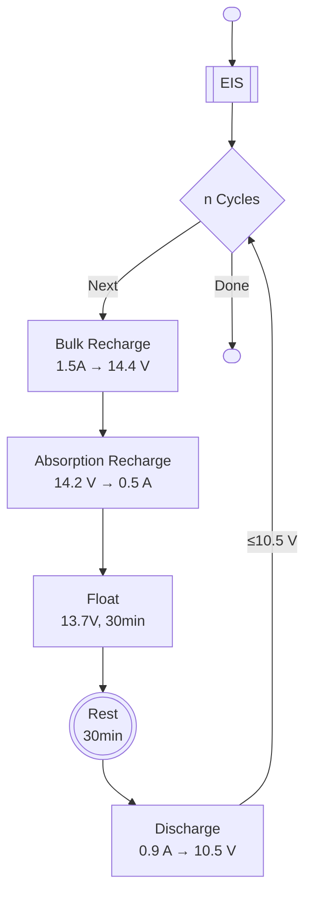

# UCT003 Low Temperature State of Health Methodology

Lawrence Stanton  
**November 2024**

## Summary

This experiment is focused at investigating the long-term State of Health (SoH) effects of AGM sealed lead acid batteries in extreme low temperature conditions. Batteries will set to a variety of States of Charge (SoC) and then subjected to low temperature conditions for extended period of time, while being periodically cycled at room temperature to evaluate the SoH.

## Basic Test Parameters

| Parameter                 |    Value |
|:--------------------------|---------:|
| Battery Manufacturer      | Asterion |
| Nominal Voltage           | 12V (6S) |
| Nominal Capacity          |      9Ah |
| Maximum Discharge Current |     2.7A |
| Test Batch Quantity       |       10 |
| Expected Test Time        |  1 Month |

## Methodology

The experiment will be composed of several functional test programs:

1. [Varied Discharge](#varied-discharge-preconditioning)
2. [Low Temperature Storage](#low-temperature-storage)
3. [Full Discharge Test & EIS](#full-discharge-test--eis)

Each follows sequentially, and repeated for a range of storage temperatures and durations.

### Full Discharge Test & EIS

The following program should always be followed to perform a full discharge and EIS test:

The EIS program is the same as used in UCT002.

At least 3 discharge cycles are preformed per test and at most 5 (in exceptional circumstances).

Both the EIS and discharge test is always done at room temperature, preferably in the water bath. Allow at least 6 hours in the water bath following low temperature before starting. Record the temperature periodically for temperature verification. Halt work if conditions range above 32 °C.

Please monitor the discharge times and report any outliers or anomalies before proceeding to the next low temperature storage period.

### Varied Discharge Preconditioning

The varied discharge follows the exact same procedure as the full discharge test, except the discharge step is programmed to stop after a set discharge amount, and exits immediately following discharge (no cycling).

> [!IMPORTANT]
> The varied discharge should begin immediately following the full discharge test. Do not allow the batteries to stand at full discharge for extended periods of time.

The following amounts should be used for each battery:

| Battery | Discharge Amount |
|:-------:|:----------------:|
|   C01   |      0.6Ah       |
|   C02   |      1.2Ah       |
|   C03   |      1.8Ah       |
|   C04   |      2.4Ah       |
|   C05   |      3.0Ah       |
|   C06   |      3.6Ah       |
|   C07   |      4.2Ah       |
|   C08   |      4.8Ah       |
|   C09   |      5.4Ah       |
|   C10   |      6.0Ah       |

### Low Temperature Storage

The batteries shall be repeatedly stored in open circuit in the environmental test chamber for extended periods of time. The following schedule should be followed:

| Stage | Temperature | Repetitions | Duration |
|:-----:|:-----------:|:-----------:|:--------:|
|  S01  |   -00 °C    |      3      |   24h    |
|  S02  |   -00 °C    |      1      |   72h    |
|  S03  |   -10 °C    |      3      |   24h    |
|  S04  |   -10 °C    |      1      |   72h    |
|  S05  |   -20 °C    |      3      |   24h    |
|  S06  |   -20 °C    |      1      |   72h    |
|  S07  |   -30 °C    |      3      |   24h    |
|  S08  |   -30 °C    |      1      |   72h    |
|  S09  |   -40 °C    |      3      |   24h    |
|  S10  |   -40 °C    |      1      |   72h    |

Total Storage Time: **20 Days**

Complete the schedule in the above order.

> [!NOTE]
> Unlike previous experiments, this experiment will run from warmest to coldest temperatures.

It is acceptable to remotely raise the temperature to 25 °C (or ambient) and wait until performing discharge tests when the scheduled end time is outside working hours.

## Deliverables

The following data should be delivered:

1. Depth of Discharge Test Records
1. Varied Discharge Test Records
1. EIS Spectra
1. Environmental Chamber Temperature Records
1. Lab notes detailing:
    1. Exact times of manual actions (moving of batteries).
    1. Any deviations from the test plan.

CSV is acceptable format, but please advise if there are other records.

## Naming Conventions

Please comment tests with the following format for unique and uniform identification:

`UCT003-<DOD|VD|EIS>-<Battery>-<Stage>-[Errata]`

- `DOD|VD|EIS` - Depth of Discharge, Varied Discharge, or EIS (type of test).
- `Battery` - Battery number (C01-C10).
- `Stage` - Stage number (S01-S10).
  - The stage is what the batteries were most recently subjected to. Use `S00` for initial preconditioning.
- `[Errata]` - Any additional notes or deviations from the test plan. Make lab notes for details.

## Planned Visits

Lawrence Stanton will visit the lab for initial setup and verification of the test programs. This will be a 1-2 day visit.

More visits can be scheduled if things don't go to plan.

## Materials

19 Asterion HR12-9 batteries have been in storage at uYilo and 10 of these will be used. 2 more will be used as dummies. The remaining 7 will be kept as spares, should anything unexpectedly catastrophic happen.

All batteries will be returned to UCT after this experiment, as will be arranged.

## Possible Early Exit Criteria

Should the depth of discharge tests move to below 50% of the 9Ah rated capacity, some batteries or the entire test may be terminated early as this would indicate a conclusive result.
