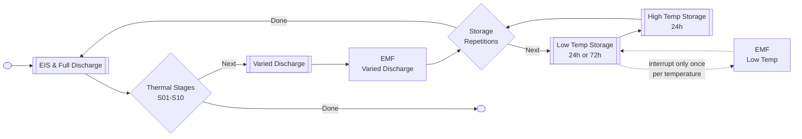
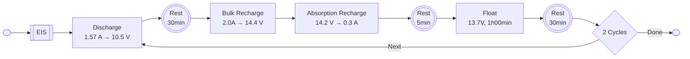
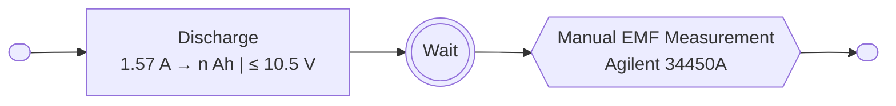

# UCT003 Low Temperature State of Health Experiment Methodology

Lawrence Stanton  
**February 2025**

## Summary

This experiment is focused at investigating the long-term State of Health (SoH) effects of AGM sealed lead acid batteries in extreme low temperature conditions.
Batteries will be set to a range of States of Charge (SoC) and then subjected to low temperature conditions for extended periods of time, while being periodically subjected to a full Depth of Discharge test at 25 °C to evaluate the SoH.

## Basic Test Parameters

| Parameter                                |            Value |
|:-----------------------------------------|-----------------:|
| Battery                                  |  Asterion HR12-9 |
| Nominal Voltage                          |        12 V (6S) |
| Nominal Capacity (1.57 A rate)           |          7.85 Ah |
| Absolute Max Charge Current              |            2.7 A |
| Absolute Max Charge Voltage              |           14.4 V |
| Test Batch Battery Quantity              |               14 |
| Available Test Channels                  |                7 |
| Stages                                   |                5 |
| Storage Repetitions per Stage            | 4 (3x24h, 1x72h) |
| Discharge Tests per Stage per Battery    |                1 |
| Discharge Test Approx. Duration          |         15 hours |
| Initial Preconditioning Cycles           |               14 |
| Total Discharge Tests                    |               70 |
| Total Discharge Test Time                |           7 Days |
| Total ETC Storage Time per Stage         |           4 Days |
| Total ETC Storage Time (Low Temperature) |          30 Days |

Estimated Total Test Time: **3 Months**

## Methodology

The experiment will be composed of several functional test stages:

1. [Varied Discharge](#varied-discharge) (including post EMF Voltage Measurement)
2. [Low Temperature Storage](#low-temperature-storage) (including EMF Voltage Measurement at low temperatures)
3. [Full Discharge Test and EIS](#full-discharge-test-and-eis) (including Preconditioning)

Each follows sequentially, and repeated for a range of storage temperatures and durations.

### Full Discharge Test and EIS

The following program should always be followed to perform a full discharge and EIS test:

> The 30min rest periods evaluate the EMF at that point, the 5min rest period is a simple workaround for the test bench, which may skip the float step if the current drops to zero.

2 repetitions allow for a first partial discharge from the prior varied discharge conditions, following which a full recharge, full discharge, and second full recharge follow.

The EIS program is the same as used in UCT002. Both the EIS and discharge test are always done at room temperature. Allow for 1 day at room temperature to warm up before stating these tests.
Additional low temperature EIS tests might be performed if deemed necessary, but are not currently planned.

> EIS tests have been suspended due to issues with the spectrometer.

Please monitor the discharge amounts and report any if any battery drops to <5Ah discharge capacity or other anomalies before proceeding to the next varied discharge step.

#### Preconditioning

To evaluate the initial capacity for a 1.57 A (5 hour) discharge rate against the other charging parameters; at factory conditions, the batteries should undergo an additional initial full discharge test.
These few cycles should also remove any initial artefacts from the batteries' manufacturing.

### Varied Discharge

The varied discharge follows the final full recharge of the prior discharge test, and is therefore a simple discharge step:

After the varied discharge, the batteries should be left for some time (>1h) to rest before taking a manual EMF measurement with the Agilent 34450A multimeter.

> The deepest discharge batteries (`C08`-`C14`) should be done last.
> It is acceptable to allow `C01`-`C07` to wait at their varied discharge SoC while `C08`-`C14` complete.

Initial discharge tests indicate a >6Ah initial capacity, given the charging parameters of this test, compared to the manufacturer's 1.57A capacity is 7.85Ah.

The following amounts should be used for each battery:

| Battery | Discharge Amount | Battery | Discharge Amount |
|:-------:|:----------------:|:-------:|:----------------:|
|  `C01`  |     0.00 Ah      |  `C08`  |     3.15 Ah      |
|  `C02`  |     0.45 Ah      |  `C09`  |     3.60 Ah      |
|  `C03`  |     0.90 Ah      |  `C10`  |     4.05 Ah      |
|  `C04`  |     1.35 Ah      |  `C11`  |     4.50 Ah      |
|  `C05`  |     1.80 Ah      |  `C12`  |     4.95 Ah      |
|  `C06`  |     2.25 Ah      |  `C13`  |     5.40 Ah      |
|  `C07`  |     2.70 Ah      |  `C14`  |     5.85 Ah      |

> `C14` will end very near to the 10.5 V cut-off voltage.
> Ensure the 10.5 V threshold is programmed as an alternate exit condition to handle this possibility.
> Proceed normally if this occurs, the SoC estimates will simply be scaled to assume `C14` is at 0% SoC.

### Low Temperature Storage

The batteries shall be repeatedly stored in open circuit in the Environmental Test Chamber (ETC) for extended periods of time. The following schedule should be followed:

| Stage | Temperature | Repetitions | Duration |
|:-----:|:-----------:|:-----------:|:--------:|
| `S01` |   -00 °C    |      3      |   24h    |
| `S02` |   -00 °C    |      1      |   72h    |
| `S03` |   -10 °C    |      3      |   24h    |
| `S04` |   -10 °C    |      1      |   72h    |
| `S05` |   -20 °C    |      3      |   24h    |
| `S06` |   -20 °C    |      1      |   72h    |
| `S07` |   -30 °C    |      3      |   24h    |
| `S08` |   -30 °C    |      1      |   72h    |
| `S09` |   -40 °C    |      3      |   24h    |
| `S10` |   -40 °C    |      1      |   72h    |

Between each stage there shall be an interim storage period of 24h at high temperature, which may either be done actively at 25 °C within the ETC or passively in free air.

Total Storage Time: **40 Days (20 at low temperature)**

Complete the schedule strictly in the above sequence from `S01` to `S10`.

The temporal accuracy of the storage periods is not critical, but should remain within ±2 hours of the scheduled duration.
The duration is simply measured from the time the ETC is set to run to the time it is stopped, neglecting any time to cool or heat up.

> Unlike previous experiments, this experiment will run from warmest to coldest temperatures.  

It is acceptable to remotely turn off the ETC and wait, for a maximum of 2 days, before starting discharge tests when the scheduled end time is outside working hours.

### Low Temperature EMF Voltage Measurement

The EMF voltage at low temperature is an interesting metric to record for the low temperatures.
During any one repetition within a temperature (either during one of the 24h storage cycles or alternatively the 72h cycle), interrupt the rest and measure each battery's voltage with the Agilent 34450A multimeter.
Do so quickly and resume the ETC program immediately after.
It is not necessary to use the styrofoam insulation for these measurements.

### Alarms

In addition to the above procedures, alarms should be put in place to alert if the battery experiences any of the following conditions:

1. Battery voltage drops below 10.5 V.
1. Battery voltage rises above 14.4 V.
1. Battery current exceeds 2.7 A (both charge and discharge).

Halt the test should any of these conditions occur.

## Sub-batch Grouping, Priority, Test Suspension

The batch size will require a significant amount of channels and time to perform the discharge tests. The batch may therefore be split into subgroups for the discharge tests to accommodate the number of channels. Priority should be given to the lowest SoC batteries, to minimize the known consequences of extended periods of time at low SoC on SoH. i.e. `C10`-`C14` should move to discharge testing before `C01`-`C05`, etc. The `Crude Recharge` step is also made on this consideration for batteries waiting post-discharge testing and prior to varied discharge.
Having at least 7 channels available however will greatly reduce the total experiment time.

If necessary, the entire experiment may be suspended after all batteries have completed the discharge tests, including the `Crude Recharge` step, where all batteries will be in the same state of charge.

## Deliverables

The following data should be delivered:

1. Depth of Discharge Test Records
1. Varied Discharge Test Records
1. EIS Spectra
1. Environmental Chamber Temperature Records
1. Lab notes detailing:
    1. Exact times of manual actions (moving of batteries).
    1. Any deviations from the test plan.

CSV is acceptable format, but please advise if there are other formats available from the test equipment.

Please deliver scanned lab notes periodically as they are made, this will be ok for progress tracking.

## Naming Conventions

Please comment tests with the following format for unique and uniform identification:

`UCT003-<DOD|VD|EIS>-<Battery>-<Stage>/<Repetition>-[Errata]`

* `DOD|VD|EIS` - Depth of Discharge, Varied Discharge, or EIS (type of test).
* `Battery` - Battery number (C01-C15).
* `Stage` - Stage number (S01-S10).
  * Use `S00` for initial preconditioning.
* `Repetition` - Repetition number (R01-R03).
* `[Errata]` - Any additional notes or deviations from the test plan. Make lab notes for details.

e.g. `UCT003-DOD-C01-S01/R01` for the depth of discharge test following the first repetition of the first stage on battery `C01`.

## Planned Visits

Lawrence Stanton will visit the lab for initial setup and verification of the test programs. This will be a 1-3 day visit.

More visits can be made. Otherwise, this experiment will be supervised independently by Masa.

## Materials

19 Asterion HR12-9 batteries have been in storage at uYilo and 14 of these will be used. 3 more will be available as dummies. The remaining 2 will be kept as spares, should anything unexpectedly catastrophic happen.

All batteries will be returned to UCT after this experiment, as will be arranged. No teardowns are planned.

## Possible Early Exit Criteria

Should the depth of discharge tests move to below 50% of the 7.85 Ah 5h-rated capacity, some batteries or the entire test may be terminated early as this would indicate a conclusive result, and speed up the experiment time to completion.
